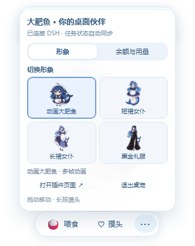

# 大肥鱼桌宠 · DeepSeek Harness

陪你工作的鲸鱼娘桌面伙伴，支持 **拖动、喂食、摸头、任务状态反馈**，并可在 **四种形象** 之间自由切换。

**[下载 Windows 完整包](https://github.com/DawnVerge/dsh-whale/releases/download/v0.2.0/fatfish-desktop-windows-x64.zip)** · **[v0.2.0 发布说明](https://github.com/DawnVerge/dsh-whale/releases/tag/v0.2.0)** · **[反馈问题](https://github.com/DawnVerge/dsh-whale/issues)**

本地动画，不需要 API Key，也不会额外调用模型。

## 四种形象

| 动画大肥鱼 | 短裙女仆 | 长裙女仆 | 黑金礼服 |
| :---: | :---: | :---: | :---: |
|  |  |  |  |
| 多帧角色动画 | 透明立绘与动作特效 | 透明立绘与动作特效 | 透明立绘与动作特效 |

点击互动栏的 **··· → 切换形象**，再点击对应缩略图。选择立即生效，重新打开后自动恢复；独立桌宠与 DSH 内浮窗各自记住选择。

所有形象均支持拖动、喂食、摸头和任务状态反馈。新增三套通过呼吸、摇摆、跳跃、饭碗与爱心特效回应互动；图片加载失败时会提示并切回动画大肥鱼。

<details>
<summary>查看形象切换菜单</summary>



</details>

## 安装和启动（Windows x64）

完整包已包含桌宠运行环境，无需另外安装 Node.js 或 Electron。DSH 桌面客户端插件接口以 **0.2.0-rc.2** 为验证基线。

### 首次安装

1. 下载 [fatfish-desktop-windows-x64.zip](https://github.com/DawnVerge/dsh-whale/releases/download/v0.2.0/fatfish-desktop-windows-x64.zip) 并解压，保留整个文件夹。
2. 打开 **DeepSeek Harness 桌面客户端 → 设置 → 插件 → 添加插件**。
3. 在 **「包名或地址」** 中粘贴解压文件夹内 `dsh-whale-companion-0.2.0.tgz` 的完整路径。
4. 安装后点击 **立即启用**。如客户端提示需要重启，退出并重新打开 DSH。
5. 双击同一文件夹内的 **WhaleCompanion.exe**。

完整路径示例，按实际解压位置替换：

```text
D:\桌宠\FatWhaleCompanion-v0.2.0-win32-x64\dsh-whale-companion-0.2.0.tgz
```

桌宠会出现在 Windows 桌面的右下角，保持透明、置顶；DSH 最小化后也能看见。客户端内同时提供悬浮版本，独立桌宠运行时自动隐藏客户端内的角色。启动后自动发现 DSH 动态端口，无需手填端口。

仅安装插件、不启动独立小窗时，会在 DSH 界面内显示大肥鱼。退出桌宠可用角色菜单或系统托盘右键菜单；关闭 DSH 后桌宠仍可拖动、喂食、摸头，任务联动将在 DSH 启动后自动恢复。

### 从旧版升级

1. 从系统托盘退出旧版桌宠。
2. 在 DSH 插件管理中卸载旧版同名插件。
3. 按首次安装步骤导入新版 `.tgz`，启用并按提示重启 DSH。
4. 运行新解压文件夹内的 `WhaleCompanion.exe`。

升级时需要同时更新插件和独立桌宠程序；使用同一 DSH 数据目录时，原有喂食和摸头计数会保留。

### 下载文件说明

| 文件 | 用途 |
| --- | --- |
| [fatfish-desktop-windows-x64.zip](https://github.com/DawnVerge/dsh-whale/releases/download/v0.2.0/fatfish-desktop-windows-x64.zip) | Windows 完整桌宠，包含运行环境和 DSH 插件包 |
| [dsh-whale-companion-0.2.0.tgz](https://github.com/DawnVerge/dsh-whale/releases/download/v0.2.0/dsh-whale-companion-0.2.0.tgz) | 单独安装 DSH 插件，使用客户端内浮窗 |
| [SHA256SUMS.txt](https://github.com/DawnVerge/dsh-whale/releases/download/v0.2.0/SHA256SUMS.txt) | 核对下载文件的 SHA256 |

## 怎么玩

| 操作 | 效果 |
| --- | --- |
| 按住角色拖动 | 移动桌宠，松手后保留位置 |
| 点击“喂食” | 大肥鱼吃饭并开心回应 |
| 点击“摸头”，或长按角色约 0.65 秒 | 摸头、摇头和爱心动画 |
| 单击角色 | 轻轻摸摸头 |
| DSH 开始思考 | 思考动作 |
| DSH 执行任务 | 工作动作 |
| 任务完成 | 跳跃庆祝 |
| 任务失败 | 失败反馈与提示 |
| 等待审批 | 等待提示；在 DSH 中处理审批 |

## 常见问题

**装了插件，桌面上却没有角色？**

先确认插件已启用。仅安装插件会显示 DSH 内浮窗；独立桌宠需要额外运行完整包中的 `WhaleCompanion.exe`。

**更新后仍然只有原来的大肥鱼？**

退出旧版桌宠，确认安装的是 v0.2.0 插件，再从新版解压文件夹启动程序。点击互动栏的 **···** 查看四种形象。

**EXE 提示缺少 DLL，或者立绘无法加载？**

重新完整解压安装包，保留 `resources`、DLL 等全部文件，不要单独移动 EXE。立绘加载失败时会回退到动画大肥鱼。

**关闭 DSH 后还能使用吗？**

可以拖动、喂食和摸头，任务状态反馈会在 DSH 重新连接后恢复。离线互动提供本地动作反馈，不会追加到 DSH 的计数中。

**怎样退出或收起？**

独立桌宠可通过 **··· → 退出桌宠** 或系统托盘右键菜单退出；DSH 内浮窗可通过 **··· → 收起桌宠** 隐藏。

## 从源代码运行

插件宿主和网页动画不需要额外 npm 依赖，要求 Node.js 22 或更新版本。

在 DSH 的插件添加页面，直接填入本仓库目录的绝对路径，也可安装 `npm pack` 生成的 `.tgz`。

独立桌宠使用 Electron：

```powershell
git clone https://github.com/DawnVerge/dsh-whale.git
cd dsh-whale
npm --prefix desktop install
npm --prefix desktop start
```

如需要指定独立 DSH 实例：

```powershell
npm --prefix desktop start -- --url http://127.0.0.1:3080
# 或使用该实例的 DSH_HOME，自动读取端口发现文件
npm --prefix desktop start -- --home C:\path\to\dsh-home
```

只接受本机 HTTP(S) 地址。`DSH_PET_URL` 也可指定地址；优先级为 `--url`、环境变量、端口发现文件、默认 `127.0.0.1:3080`。

CLI Web 版可这样安装：

```powershell
dsh plugin --profile web add "C:\absolute\path\to\dsh-whale"
```

桌面客户端的 `desktop` 配置由客户端管理，请通过上面的插件页面安装。

## 预览、验证与打包

自动测试与宿主检查：

```powershell
npm test
node --test desktop/test/*.test.cjs
npm run check
node scripts/host-smoke.mjs
```

宿主检查需要真实 Cordis 运行时；自动查找失败时，可用 `--cordis <安装目录或入口文件>` 指定。

界面检查需要先安装 `desktop` 依赖。在一个终端启动预览：

```powershell
npm run preview
```

预览地址为 `http://127.0.0.1:4318`，页面上的任务状态按钮用于演示。在另一个终端运行：

```powershell
node scripts/ui-smoke.mjs
```

界面检查会实际启动 Electron，检查形象切换、记忆、互动和模拟任务事件，完成后退出桌宠。

打包插件与独立桌宠：

```powershell
npm pack
npm run desktop:pack
node scripts/ui-smoke.mjs --portable
```

Electron 默认打包产物在 `dist/FatWhaleCompanion-win32-x64/`，需要保留整个文件夹。若目录已存在，先移动备份，或设置 `WHALE_PACK_NAME` 使用新目录名；便携版检查也通过同一环境变量定位构建产物。

下载 Electron 运行时较慢时，可为安装进程设置 `ELECTRON_MIRROR=https://npmmirror.com/mirrors/electron/`；下载按 Electron 包内的校验和验证。

## 数据保存

| 数据 | 保存位置 |
| --- | --- |
| 喂食和摸头计数 | `<DSH_HOME>/data/dsh-whale-companion/state.json` |
| DSH 端口发现记录 | 同目录的 `connection.json` |
| 独立桌宠位置 | Electron 用户数据目录中的 `position.json` |
| 当前形象 | 当前客户端的本地存储 |

卸载插件不会删除计数；退出独立桌宠会释放桌面占用标记，异常退出后标记最多 15 秒自动过期，DSH 内浮窗恢复显示。

## 验证范围

v0.2.0 已通过 **13 项插件自动测试、5 项桌面配置测试、真实 Cordis 加载检查，以及源码版和 Windows 便携版 Electron 交互检查**。

依据本机 DSH Desktop **0.2.0-rc.2** 的源码确认插件接口，任务联动使用模拟宿主事件验证。没有改动现有 DSH 配置，尚未在用户当前会话中执行端到端任务测试。其他版本需要核对其插件接口。

## 许可证

插件代码使用 [MIT 许可](LICENSE)。素材处理与署名见 [THIRD_PARTY_NOTICES.md](THIRD_PARTY_NOTICES.md)。

本项目为非官方 DeepSeek Harness 插件。
